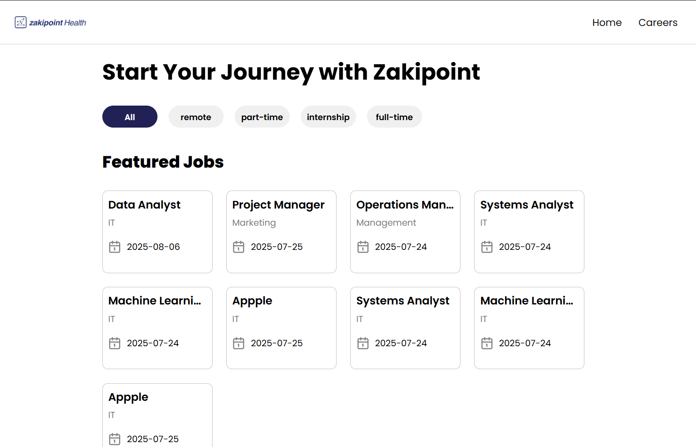
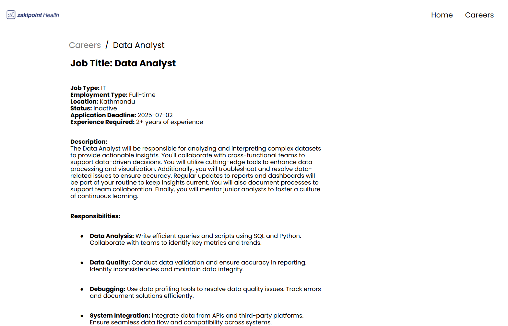
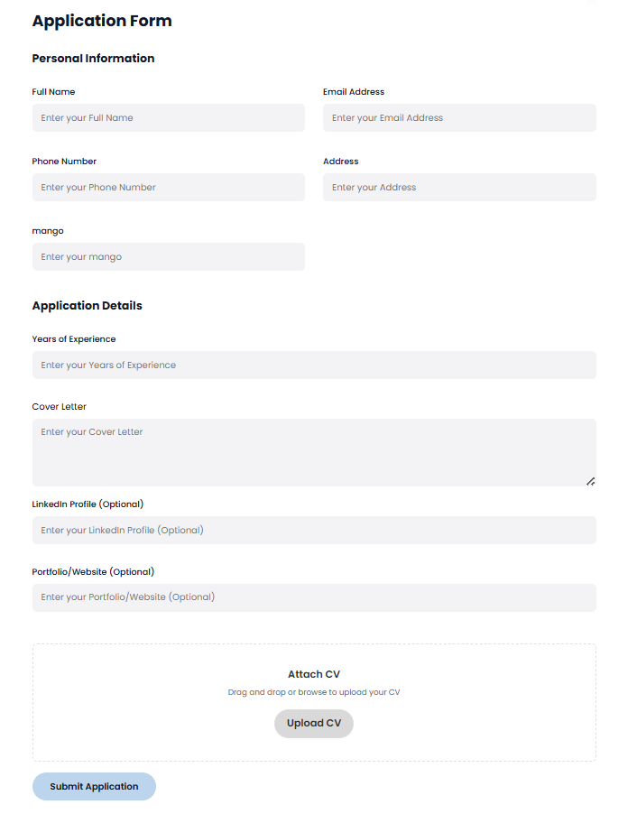

#  Careers Page

This project is a responsive and interactive **Careers Page** built for **Zakipoint Health** using **React.js**, **CSS**, and **JavaScript**. It provides a user-friendly interface for candidates to explore job openings, learn about company culture, and apply for positions directly.

---

## ✨ Features

- 🔍 **Job Listings**: Display current open positions with title, location, and description.

- 📝 **Application Form**: Allow users to apply directly with name, email, CV, and cover letter.

- 🎨 **Responsive Design**: Mobile-first layout that adapts to all screen sizes.
- ⚙️ **Reusable Components**: Modular design using React components for maintainability.

---

## 🚀 Tech Stack

- **React.js** – Component-based UI building
- **CSS** – Custom styling and layout
- **JavaScript** – Dynamic behavior and form handling
- **Axios / Fetch API** – (Optional) For submitting job applications to a backend or Google Sheets

---

